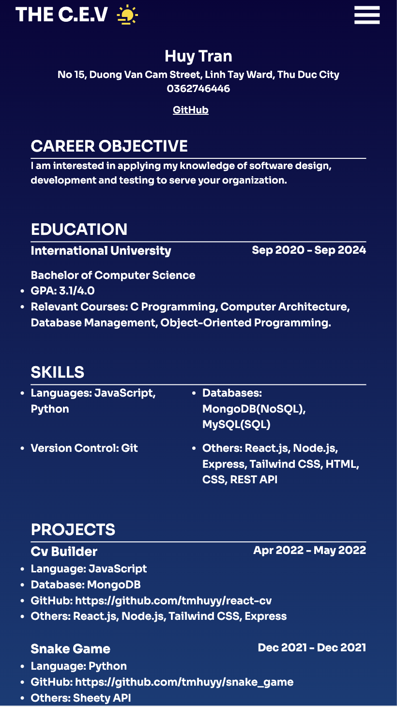
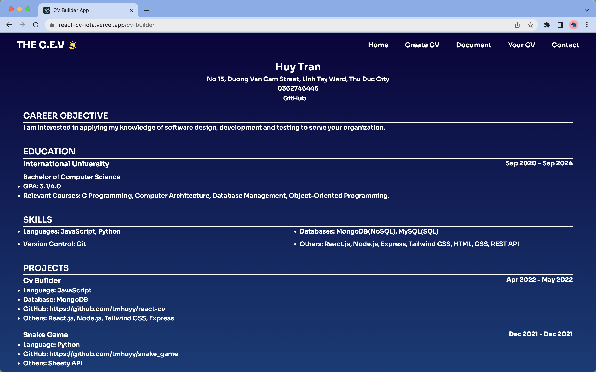

# [CV BUILDER](https://react-cv-iota.vercel.app/)
CV Builder is a web application for building personal résumè. 

- asdas
- asdasd
- asdasd

## Installation
- Install Node.js.
- Clone repository.
- Run <code>npm install</code> to install **packages**.
## Documentation
- Dark Mode Utility
    - Light mode, click **sun symbol**.
    - Dark mode, click **moon symbol**.
- Responsive Desgin Utility
    - Mobile: <code>iPhone SE, 6/7/8Plus (375x667)</code>.
    - Laptop: <code>MacBook Air M1 2020 (1440x821)</code>.
- How To Use
    - After typing data from each field is **finished**, <code>Send First</code> button must be clicked.
    - To render the user's cv, click <code>Submit</code> button
- **NOTE**: <code>Prev</code> button clears the user’s previous data. 
## Screenshots
| |
|:---:|
| **Landing page for Mac**|

| |
|:---:|
| **Landing page for iPhone SE/6/7/8 Plus** |

| |
|:---:|
| **Light mode** |

| |
|:---:|
| **Create CV page** |

| |
|:---:|
| **Last form field** |

| |
|:---:|
| **Cv for mobile** |

| |
|:---:|
| **Cv for mac** |
## Contributing
Vinh Bao Phuc - ITITIU20127  - **Leader**
 
Tran Minh Huy - ITITIU20219
 
Nguyen Vu Nhat Quang - ITITIU20149 
 
Nguyen Thanh Hien - ITITIU20142 
  
Tran Ngoc Nhan - ITITIU20264 